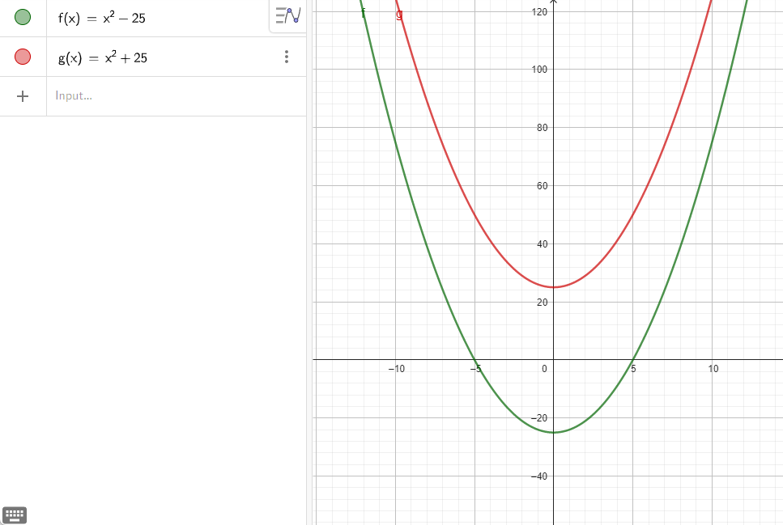
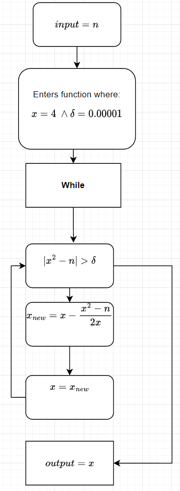

- *Type:* Individual assignment
- *Due:* 10 April 2022, 23:59

```{r}
pacman::p_load(tidyverse)
```


## 1. Square root function

Along the lines of section 6.4.2 (p. 247ff) in Gill’s book, write an _R_ function that calculates the square root of a given positive number. Your solution should contain:

```{r}
# function called Nsqrt
Nsqrt <- function(n) {
  # Make variable x (start)
  x <- 4
  delta <- 0.00001
  # n = the number we're taking the square root of
  # x = the start x value when using the Newton-Raphson method
  while (abs(x^2-(n)) > delta) {
    
    x_new <- x - (x^2-n)/(2*x) 
    
    x <- x_new
  }
  
  # Returning x which is now defined as x = sqrt(n)
  return(x)
}
```


You enter a value $n$ that you want to calculate. Inside the function $x$ is defined as $x=4$. The value of $x$ isn't important on my PC since it goes so fast anyway, but it might be a factor on slower computers. In that case I would've looked for a way to make $x$ value depend on the n value so to have a start $x$ value that is closer to the final value when using Newton's method which would result in faster computation. 

Another function vector is $\delta$ where $\delta=0.00001$ The lower the value of $\delta$ the more precise the final output but can also result in longer computation times.  

Afterwards the function enters a while loop. Inside the loop you run the formula for newton's method with the function $f(x)= x^2-n$ which comes out as $x_{new}=x-\frac{x^{2}-n}{2x}$. Then $x$ gets defined as $x = x_{new}$ inside the while loop and the loop repeats. This works since $f(x)= x^2-n$ equals $0$ when $x=\sqrt{n}\ and \ n > 0$ 

Since $x = \sqrt{n} \Rightarrow x^{2}=n\Rightarrow x^{2}-n=0$ If $|x^{2}-n|<\delta$ the while loop ends and $x$ gets outputted. This makes sense since if $|x^{2}-n|<\delta$, then $x$ must be really close to it's true value.

I'll now make a demonstration with the following examples where we'll try to find the values of $\sqrt{n}=\sqrt{25}$ and $\sqrt{n}=\sqrt{-25}$. I'll start with the first mentioned example using Newton's method where the starting x-value equals 4. 

$x_{new}=4-\frac{4^{2}-25}{2*4}=5.125$

$x = x_{new}$

Loop repeats

$x_{new}=5.125-\frac{5.125^{2}-25}{2*5.125}$

$x = x_{new}$

loop repeats  until $|x^{2}-25| < \delta$ and $x$ is outputted

In the second example  $n < 0 \Rightarrow\ f(x)=x^2+n>0\ \forall \ \mathbb{R}$. This means that you can't use the newton's method(or any method) to find the $x$ value where $f(x)=0$ and finding where $|x^{2}-n|<\delta$ will therefore never be found. The result is an infinite loop where there's never given an output. 





The function works by you selecting some value you want to calculate the square root. For example $\sqrt{25}$


a) A quick introduction into what the function does and why it works


b) A discussion of the choices you made (e.g., starting point of the algorithm)
Done this

c) A range of examples
Two examples so far

d) A discussion of what happens when the program is applied to negative numbers
Had an example with negative numbers where I explained.


## 2. Power series derivatives

The power series definitions ($:=$ means "is defined as") of the exponential, sine, and cosine functions are

\begin{align*}
    \exp(x) &:= \sum_{n=0}^\infty \frac{x^n}{n!},\\[8pt]  
    \sin(x) &:= \sum_{n=0}^\infty \frac{(-1)^nx^{2n+1}}{(2n+1)!}, \\[8pt]
    \cos(x) &:= \sum_{n=0}^\infty \frac{(-1)^nx^{2n}}{(2n)!}.
\end{align*}

Using these definitions, show that

\newcommand{\dx}{\:\mathrm{d}x}
\newcommand{\md}{\mathrm{d}}
\newcommand{\dfdx}{\frac{\md}{\dx}}
\begin{align*}
    \dfdx \exp(x) &= \exp(x), \\[8pt]
    \dfdx \sin(x) &= \cos(x), \\[8pt]
    \dfdx \cos(x) &= -\sin(x).
\end{align*}

You can either [use LaTeX](https://www.overleaf.com/learn/latex/Learn_LaTeX_in_30_minutes) or include photos of your (nicely) handwritten equations in the notebook. In any case, write down all intermediate steps.